# Project Implementation Steps

## Step 1: Sign in to AWS Management Console

1.  Click on the **Open Console** button, and you will get redirected to
    AWS Console in a new browser tab.

2.  On the AWS sign-in page,

    -   Leave the Account ID as default. Never edit/remove the 12 digit
        Account ID present in the AWS Console. otherwise, you cannot
        proceed with the lab.

    -   Now copy your **User Name** and **Password** in the Lab Console
        to the **IAM Username and Password** in AWS Console and click on
        the **Sign in** button.

3.  Once Signed In to the AWS Management Console, Make the default AWS
    Region as **US East (N. Virginia) us-east-1.**

## Step 2: Launch First EC2 Instance

In this task, we are going to launch the first EC2 instance by providing
the required configurations like name, AMI selection, security group ,
instance type and other settings. Furthermore, we will provide the user
data as well.

1.  Make sure you are in the **N. Virginia(us-east-1)** Region.

2.  Navigate to **EC2** by clicking on the **Services** menu in the top
    left, then click on **EC2** in the **Compute** section.

3.  Navigate to **Instances** from the left side menu and click on
    **Launch Instances** button.

4.  Under the **Name and tags** section :

    -   Name : Enter ***MyEC2Server1***

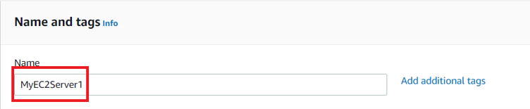

1.  Under the **Application and OS Images (Amazon Machine Image)**
    section :

    -   Select **Quick Start** tab and **Amazon Linux** under it

-   Amazon Machine Image (AMI) : select **Amazon Linux 2023 kernel 6.1
    AMI**

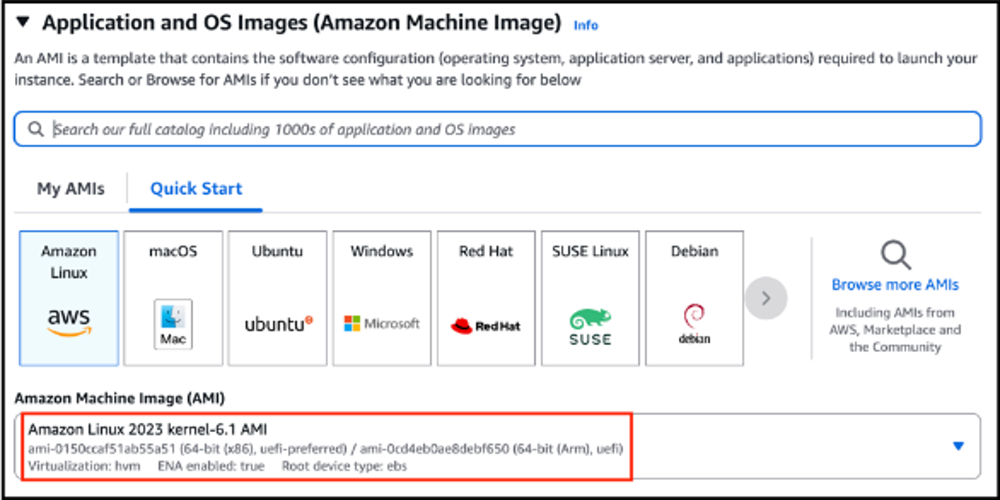

1.  Under the **Instance Type** section **:**

    -   Instance Type : Select **t2.micro**

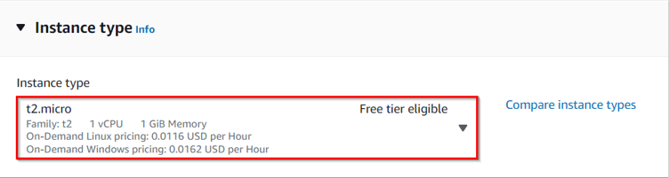

1.  Under the **Key Pair (login)** section **:**

    -   Click on **Create new key pair** hyperlink

-   Key pair name: **MyWebserverKey**
-   Key pair type: **RSA**
-   Private key file format: **.pem** or **.ppk**
-   Click on **Create key pair** and then select the created key pair
    from the drop-down.

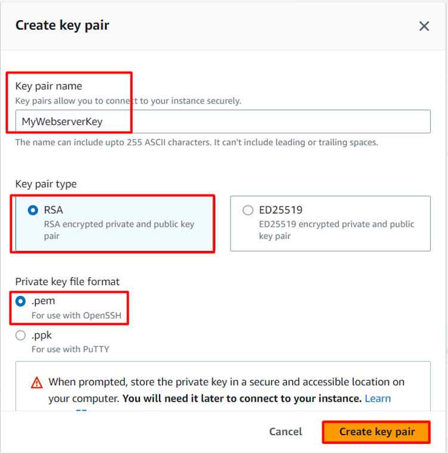

1.  Under the **Network Settings** section **:**

    -   Click on **Edit** button

-   Auto-assign public IP: select *Enable*

-   Firewall (security groups) : Select **Create a new security group**

-   Security group name : Enter **MyWebserverSG**

-   Description : Enter **My EC2 Security Group**

-   To add **SSH:**

        - Choose Type: **SSH**

-   Source: **Anywhere** (From ALL IP addresses accessible).

-   For **HTTP**, click on **Add security group rule**,

        - Choose Type: **HTTP**

-   Source: **Anywhere** (From ALL IP addresses accessible).

-   For **HTTPS**, click on **Add security group rule**,

        - Choose Type: **HTTPS**

-   Source: **Anywhere** (From ALL IP addresses accessible).

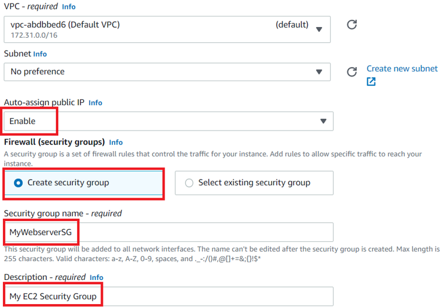

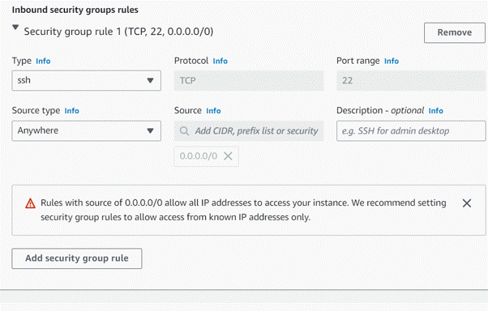

1.  Under the **Advanced details** section **:**

    -   Under the **User data:** copy and paste the following script to
        create an HTML page served by an Apache HTTPD web server.

``` bash
#!/bin/bash

dnf update -y

dnf install -y httpd

systemctl start httpd

systemctl enable httpd

echo "<html><h1> Welcome to Whizlabs Server 1 </h1></html>" > /var/www/html/index.html
```

1.  Keep everything else as default and click on the **Launch instance**
    button.
2.  **Launch Status:** Your instance is now launching, Navigate to
    **Instances** page from the left menu and wait until the status of
    the EC2 Instance changes to **running**.

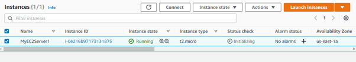

## Step 3: Launch Second EC2 Instances

In this task, we are going to launch the second EC2 instance by
providing the required configurations like name, AMI selection, security
group , instance type and other settings. Furthermore, we will provide
the user data as well.

1.  Now again click on **Launch Instances** button.

2.  Under the **Name and tags** section :

-   Name : Enter ***MyEC2Server2***

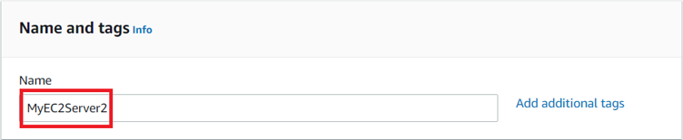

1.  Under the **Application and OS Images (Amazon Machine Image)**
    section :

-   Select **Quick Start** tab and **Amazon Linux** under it

-   Amazon Machine Image (AMI) : select **Amazon Linux 2023 kernel 6.1
    AMI**

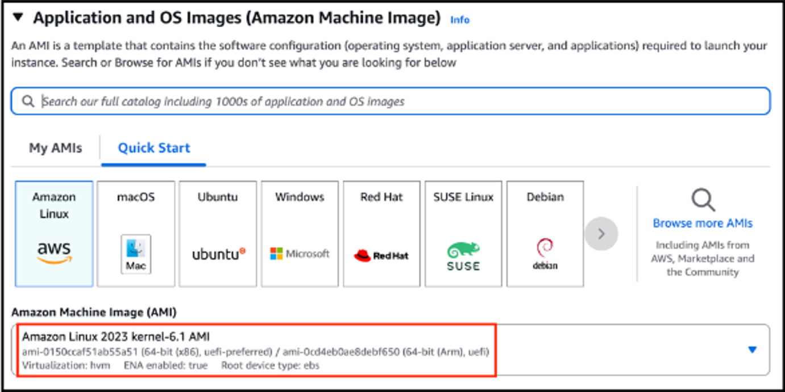

\*\* \*\*

1.  Under the **Instance Type** section **:**

    -   Instance Type : Select **t2.micro**


1.  Under the **Key Pair (login)** section **:**

    -   Select **MyWebserverKey** from the list.

2.  Under the **Network Settings** section **:**

-   Click on **Edit** button

-   Auto-assign public IP: select **Enable**

-   Firewall (security groups) : **Select existing security group**

-   Security group name : Enter\*\* MyWebserverSG\*\*

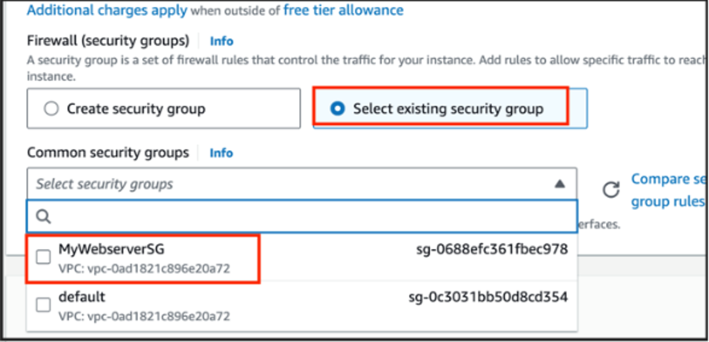

1.  Under the **Advanced details** section **:**

    -   Under the **User data:** copy and paste the following script to
        create an HTML page served by Apache httpd web server:

``` bash
#!/bin/bash

dnf update -y

dnf install -y httpd

systemctl start httpd

systemctl enable httpd

echo "<html><h1> Welcome to Whizlabs Server 2 </h1></html>" > /var/www/html/index.html
```

1.  Keep everything else as default and then click on the **Launch
    Instance** button.
2.  Your instances are now launching. Navigate to the EC2 instance page
    and wait until the status changes to the **Running**. It will
    usually take 1-2 minutes.

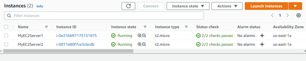

## Step 4: Create a Target Group

In this task, we are going to create a target group for the load
balancer and will add the target instances so that the load balancer can
distribute the traffic among these instances.

1.  In the EC2 console, navigate to \*\*Target Groups \*\*in the
    left-side panel under \*\*Load Balancer **in the** Load Balancing
    \*\*section.

2.  Click on **Create target group** button on the top right corner.

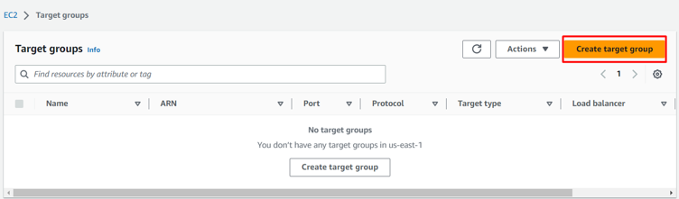

     3. Basic configuration:

-   Choose a target type : Select **Instances**

-   Target group name : Enter ***MyWAFTargetGroup***

-   Protocol : Select **HTTP**

-   Port : Enter ***80***

    4.  Health Checks:

-   Health check protocol : Select **HTTP**

5\. Under Advanced Health Check Settings :

-   Choose Healthy threshold : 3

-   Choose Unhealthy threshold : 2

-   Choose Timeout : 5 seconds

-   Choose Interval : 6 seconds

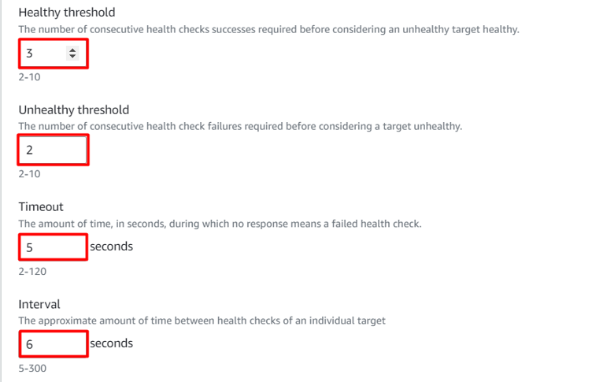

    6. Leave everything as default and click on **Next** button.

    7. Register targets:

-   Select the two instances we have created i.e **MyEC2Server1** and
    **MyEC2Server2**.

-   Click on \*\*Include as pending below \*\*and scroll down.

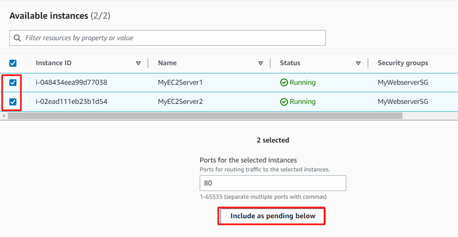

       8. Review targets:

-   Review the targets and click on \*\*Create target group \*\*button.

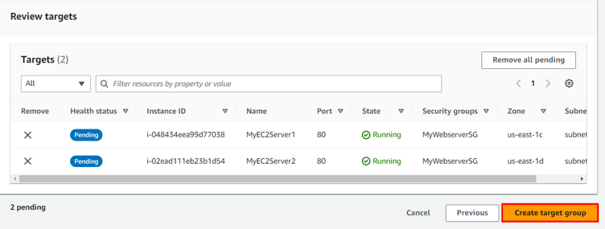

      9. Your Target group has been successfully created.

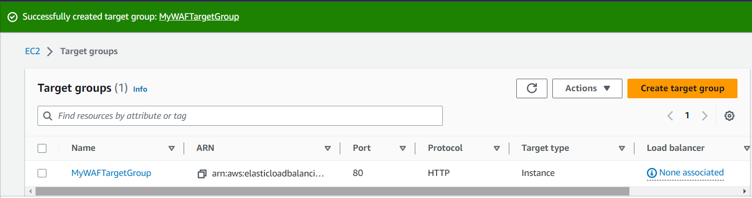

## Task 5: Create an Application Load Balancer

In this task, we are going to create an Application Load balancer by
providing the required configurations like name, target group etc.

1.  In the EC2 console, navigate to \*\*Load Balancers \*\*in the
    left-side panel under **Load Balancing**.

2.  Click on \*\*Create Load Balancer \*\*at the top-left to create a
    new load balancer for our web servers.

3.  On the next screen, choose **Application Load Balancer** since we
    are testing the high availability of the web application and click
    on **Create** button.

4.  Basic configuration:

    -   Load balancer name: Enter ***MyWAFLoadBalancer***

    -   Scheme: Select\*\* Internet-facing\*\*

    -   IP address type: Choose **IPv4**

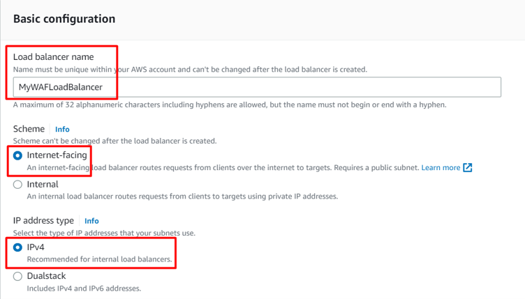

     5. Network mapping:

-   VPC : Select **Default**

-   Mappings : Check\*\* All Availability Zones\*\*

    6.  Security groups:

-   Security groups : Select\*\* \*\*an \*\*existing security group
    \*\*i.e **MyWebserverSG** from the drop down menu.

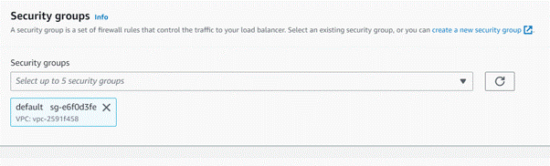

    7. Listeners and routing:

-   Protocol : Select **HTTP**

-   Port : Enter ***80***

-   Default action : Select \**MyWAFTargetGroup* \*\*\*from the drop
    down menu

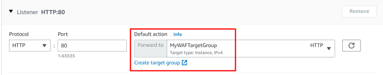

     8. Leave everything as default and click on **Create load balancer **button.

     9. You have successfully created Application Load Balancer.

## Step 6: Test Load Balancer DNS

In this task, we will test the working of load balancer by copying the
DNS to the browser and find out whether it is able to distribute the
traffic or not.

1.  Now navigate to the \*\*Target Groups \*\*from the left side menu
    under **Load balancing**.

2.  Click on the **MyWAFTargetGroup** Target group name.

3.  Now select the **Targets** tab and **wait till both the targets
    become healthy (Important)**.

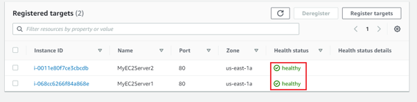

1.  Now again navigate to **Load Balancers** from the left side menu
    under **Load balancing**.
2.  Select the **MyWAFLoadBalancer** Load Balancer and copy the **DNS
    name** under **Description** tab.

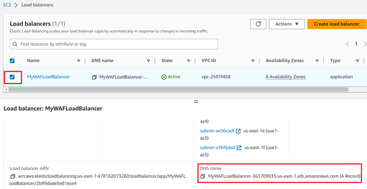

1.  Copy the **DNS name** of the ELB and enter the address in the
    **browser**.

    -   **DNS Example:
        MyWAFLoadBalancer-2020171322.us-east-1.elb.amazonaws.com**

2.  You should see the **index.html** page content of Web Server 1 or
    Web Server 2


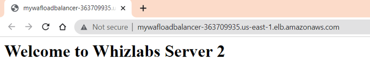

     8. Now **Refresh** the page a **few times**. You will observe that the index pages change each time you refresh.

**Note: The ELB will equally divide the incoming traffic to both servers
in a Round Robin manner**.

     9. Test **SQL Injection** :

-   Along with the ELB DNS add the following URL parameter:
    ***/product?item=securitynumber\'+OR+1=1\--***

-   Syntax : **http://\<ELB
    DNS\>/product?item=securitynumber\'+OR+1=1\--**

-   Example :
    \**MyWAFLoadBalancer-2020171322.us-east-1.elb.amazonaws.com*/product?item=securitynumber\'+OR+1=1\--\*\*\*

-   You will be able to see the below output.

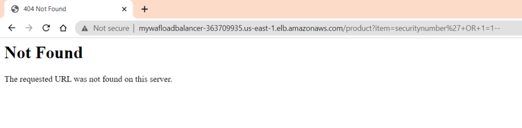

-   Here the **SQL Injection went inside the server** and since we only
    have an index page, the server doesn\'t know how to solve the URL
    that is why you got **Not Found** page.

    10. Test Query String Parameter :

-   Along with the ELB DNS add the following URL parameter:
    ***/?admin=123456***

-   Syntax : **http://\<ELB DNS\>/?admin=123456**

-   Example :
    **MyWAFLoadBalancer-2020171322.us-east-1.elb.amazonaws.com*/?admin=123456*\*\*

-   You will be able to see the below output.

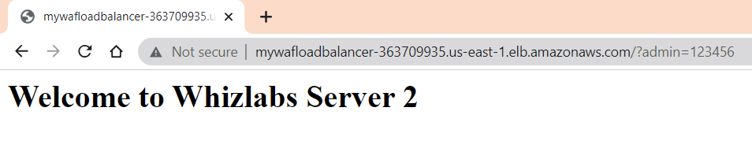

-   Here also the **Query string went inside the server** and the server
    always passes the query string inside and it is resolved by the code
    that you write. Here the query string is passed and there is no code
    to resolve the this but it wont throw any error it just becames an
    unused value. so you got a response back.

## Step 7: Create AWS WAF Web ACL

In this task , we are going to create an AWS WAF Web ACL where we will
add some customized rules for location restriction, query strings and

1.  Navigate to **WAF** by clicking on the **Services** menu in the top,
    then click on **WAF & Shield** in the **Security, Identity &
    Compliance** section.

Click on **Switch to the Old WAF Console** option at the Bottom.

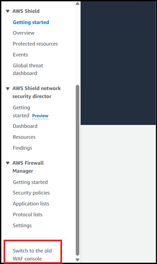

2.  Click on **Create web ACL** button.

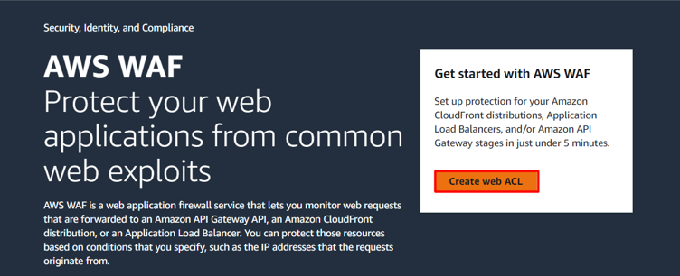

    3. Describe web ACL and associate it to AWS resources :

-   Resource type : Select **Regional resources**

-   Region : Select **US East (N.Virginia)** from the dropdown.

-   Name : Enter ***MyWAFWebAcl***

-   Description : Enter***WAF for SQL Injection, Geo location and Query
    String parameters.***

-   CloudWatch metric name : Automatically selects the WAF name, so no
    changes required.

-   **Associated AWS resources :**

-   ?Click on the **Add AWS resources** button.

-   Resource type : Select **Application Load Balancer**

-   Select **MyWAFLoadBalancer** Load Balancer from the list.

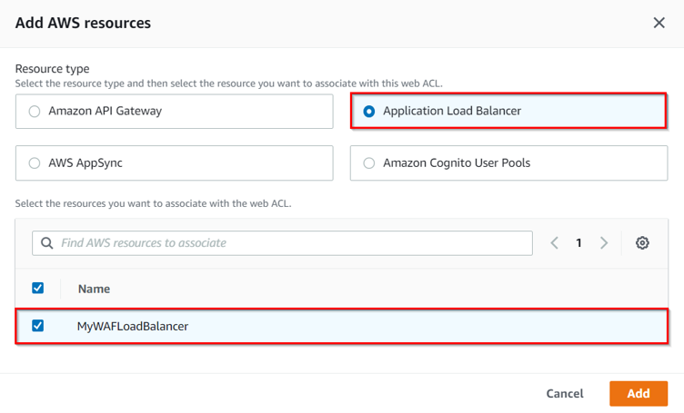

-   Now click on the **Add** button.
-   Click on the **Next** button.

1.  Add rules and rule groups :

    -   Under **Rules**, click on **Add rules** and then select **Add my
        own rules and rule groups.**

        -   Rule type : Select **Rule builder**

-   Name : Enter ***GeoLocationRestriction***
-   Type : Select **Regular rule**
-   If a request : Select **doesn\'t match the statement (NOT)**
-   Inspect : Select **Originates from a country in**
-   Country codes : Select **\<Your Country\>** In this example we
    select **India-IN**

**Note** : You can also select multiple countries also.

-   IP address to use to determine the country of origin : Select
    **Source IP address**

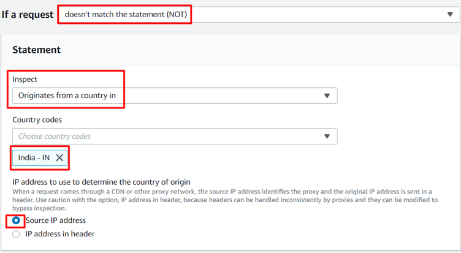

-   Under **Then** : **Action** Select **Block**.

-   Click on **Add rule**.

-   Here we are only allowing requests to come from India and all the
    requests that come from other countries will be blocked.

-   Under **Rules**, click on **Add rules** and then select **Add my own
    rules and rule groups**.

    -   Rule type : Select **Rule builder**

-   Name : Enter ***QueryStringRestriction***

-   Type : Select **Regular rule**

-   If a request : Select **matches the statement**

-   Inspect : Select **Query string**

-   Match type : Select **Contains string**

-   String to match : Enter ***admin***

-   Text transformation : Leave as default.

-   Under **Then** : **Action** Select **Block**.

-   Click on **Add rules**.

-   Anytime in the request URL contains a query string as **admin** WAF
    will block that request.

-   Under **Rules**, click on **Add rules** and then select **Add
    managed rule groups**.

    -   It will take a few minutes to load the page. It lists all the
        rules which are managed by AWS.

-   Click on **AWS managed rule groups**.

-   Scroll down to **SQL database** and enable the corresponding **Add
    to web ACL** button.

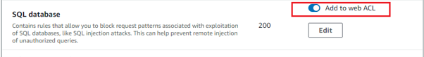

-   Scroll down to the end and click on \*\*Add rules \*\*button.

-   Now you have 3 rules added.

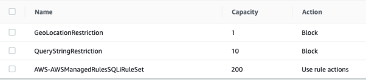

-   Under **Default web ACL action for requests that don\'t match any
    rules**, **Default action** Select **Allow**.

-   Click on the **Next** button.

1.  Set rule priority :

    -   No changes required, leave as default.

    -   You can move the rules based on your priority.

    -   Click on the **Next** button.

2.  Configure metrics :

    -   Leave it as default.

    -   Click on the **Next** button.

3.  Review and create web ACL :

    -   Review the configuration done, scroll to the end and click on
        **Create web ACL** button.

4.  It will take a few seconds to create the Web ACL, so wait till its
    completed.

## Step 8: Test Load Balancer DNS

1.  Now again navigate to \*\*Load Balancers \*\*from the left side menu
    under **Load balancing**.

2.  Select the **MyWAFLoadBalancer** Load Balancer and copy the **DNS
    name** under **Description** tab.

3.  Copy the **DNS name** of the ELB and enter the address in the
    **browser**.

    -   **DNS Example:
        MyWAFLoadBalancer-2020171322.us-east-1.elb.amazonaws.com**

4.  You should see the **index.html** page content of Web Server 1 or
    Web Server 2.

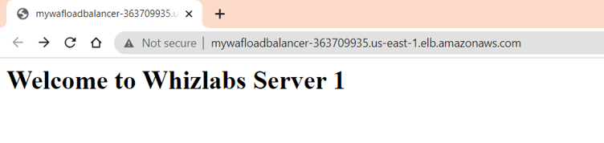

1.  Now **Refresh** the page **a few times**.You will observe that the
    index pages change each time you refresh.

**Note: The ELB will equally divide the incoming traffic to both servers
in a Round Robin manner**.

1.  Test **SQL Injection** :

    -   Along with the ELB DNS add the following URL parameter:
        ***/product?item=securitynumber\'+OR+1=1\--***

    -   Syntax : **http://\<ELB
        DNS\>/product?item=securitynumber\'+OR+1=1\--**

    -   Example :
        \**MyWAFLoadBalancer-2020171322.us-east-1.elb.amazonaws.com*/product?item=securitynumber\'+OR+1=1\--\*\*\*

    -   You will be able to see the below output.

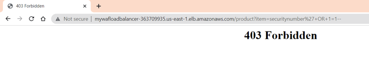

-   Here the **SQL Injection is blocked by WAF before it goes inside the
    server**.

1.  Test Query String Parameter :

    -   Along with the ELB DNS add the following URL parameter:
        ***/?admin=123456***

    -   Syntax : **http://\<ELB DNS\>/?admin=123456**

    -   Example :
        **MyWAFLoadBalancer-2020171322.us-east-1.elb.amazonaws.com*/?admin=123456*\*\*

    -   You will be able to see the below output.

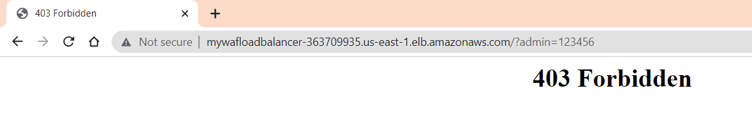

-   Here also the **Query string which contains admin is blocked by WAF
    before it could go inside the server**.

**Do you know?**

WAF can offer protection against Distributed Denial of Service (DDoS)
attacks by analyzing traffic patterns, detecting abnormal behavior, and
mitigating the impact of such attacks.

## Step 9: Delete AWS Resources

### 9.1 Deleting an EC2 Instance {#101-deleting-an-ec2-instance} {#101-deleting-an-ec2-instance-101-deleting-an-ec2-instance}

-   Make sure you are in the \*\*US East (N. Virginia) us east-1
    \*\*Region.

-   Navigate to **EC2** by clicking on the **Services** menu in the top,
    then click on **EC2** under **Compute** section.

-   Now select the EC2 instance that you have created, click on the
    **Instance State** and click on the **Terminate** option.

-   Click on **Yes,Terminate** button and your EC2 will start
    terminating.

### 9.2 Deleting Elastic LoadBalancer and Target Group {#102-deleting-elastic-loadbalancer-and-target-group} {#102-deleting-elastic-loadbalancer-and-target-group-102-deleting-elastic-loadbalancer-and-target-group}

-   In the EC2 console, navigate to **Load Balancer** in the left-side
    paneol.

-   **MyWAFLoadBalancer** will be listed here.

-   To **delete** the load balancer, need to perform the following
    actions:

    -   **Select** the load balancer,

    -   Click on the **Actions** button,

    -   Select the **Delete** option.

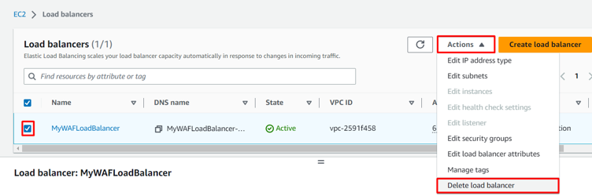

-   Confirm by typing **confirm** and then click on \*\*Delete
    \*\*button when a pop-up is shown.

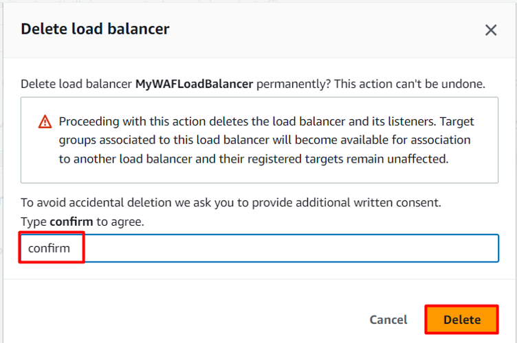

-   **MyWAFLoadBalancer** be deleted immediately.

-   In the EC2 console, navigate to **Target Groups** in the left-side
    panel.

-   \*\*MyWAFTargetGroup \*\*will be listed here.

-   To delete the **target group**, need to perform the following
    actions:

    -   **Select** the target group,

    -   Click on the **Actions** button,

    -   Select the **Delete** option.

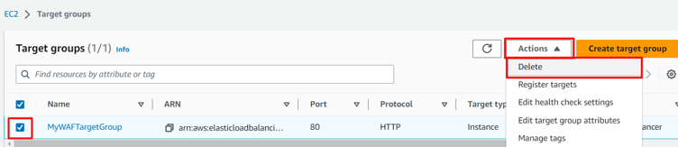

-   Now click on the **Yes, delete** button to confirm deletion.

-   **MyWAFTargetGroup** will be deleted immediately.

### 9.3 Deleting Web ACL {#103-deleting-web-acl} {#103-deleting-web-acl-103-deleting-web-acl}

-   Navigate to \*\*WAF \*\*by clicking on the **Services** menu in the
    top, then click on **WAF & Shield** in the **Security, Identity &
    Compliance** section.

-   On the left side menu, select \*\*Web ACLs \*\*and then click on the
    Web ACL name that you created, **MyWAFWebAcl**.

-   Select **Associated AWS resources** tab, select the application load
    balancer and click on \*\*Diassociate \*\*button.

-   In the textbox enter ***remove*** and click on **Diassociate**
    button.

-   On the left side menu, select **Web ACLs** and then select the radio
    button of the Web ACL that you created, **MyWAFWebAcl**.

-   Click on the **Delete** button, In the textbox enter ***delete***
    and click on **Delete** button.

-   Now the WAF will be successfully deleted.

## Conclusion

1.  We have successfully launched First EC2 Instance.

2.  We have successfully launched Second EC2 Instance.

3.  We have successfully created an Application Load Balancer and
    Target Group.

4.  We have successfully tested Load Balancer DNS.

5.  We have successfully created AWS WAF Web ACL.

6.  We have successfully tested Load Balancer DNS.
